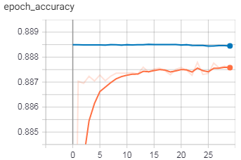
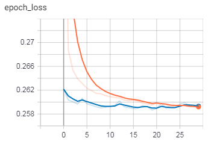

**<h1>
Lending Club Loan Approval Prediction 
</h1>**

**<h2>Problem Statement: </h2>**

1. To predict whether or not a borrower will pay back their loan, given historical data on loans given out with information on whether or not the borrower defaulted (charge-off)
2. Assessing a new potential customer whether or not they are likely to pay back the loan in the future.

&nbsp; 
**Data used**: [Click here to download](https://www.kaggle.com/hadiyad/lendingclub-data-sets/download)

&nbsp;

**<h2>Project Planning :</h2>** 

### **Data Understanding**
- **Imports -** 
  - Contains all the imports necessary for reading data, visualizations and model buiding and evaluating.
- **Getting Data -** 
  - Connecting *Google drive* to *Google colab*.
  - Understanding nature of the data *.info()*, *.describe()*
  - Function to get information about a each feature.
  - Checking numerical and categorical features.

### **Data Preparation**

- **Exploring Data**
  - Checking missing data using heatmaps.
  - Distribution of dependent variable
  - Visualization of different features to understand relations and distributions.
  - Understanding the correlation between features using heatmaps.

- **Data Preprocessing**
  - **Data Cleaning -**
    - Handling missing data for each feature using defined *function* and *median*.
    - Removing features with less information and unwanted features.

  - **Feature Engineering -**
    - Deriving numerical information from categorical features.
    - Removing features with same information and high correlation.
    - Converting all categorical features to numerical using *dummies* and dropping all original categorical features.

  - **Data Tranformation -**
    - Splitting data in to training and testing.

  - **Normalization -**
    - Scaling training and testing data using *MinMax Scaler*.

### **Modeling**
- Creating the Sequential *ANN* model.
- Compiling and Fitting the created model with *Early Stopping* and *Tensor Board* and checking the model summary.

### **Evaluation**
- **Predictions and Losses** -
  - Predictions on test set
  - Evaluation of model with classification report and confusion matrix.
  - Obtaining metrics like loss, accuracy, val_loss, val_accuracy from model
  - Plotting train v/s validation metrics of model.

- **Tensor Board**-
  - visualizing metrics on tensor board in colab.
  
  &nbsp;
  
  
  
  

- **New Customer Loan Repayment Prediction**
  - Training a model on whole dataset (X and y) without splitting.
  - Function "assess_customer" to assess new customers whether they payback loan or not.
  - Check model predictions on new customer.

