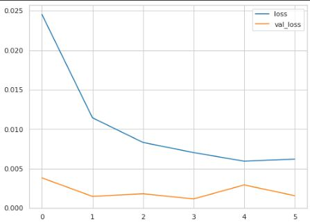
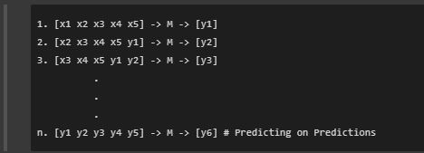
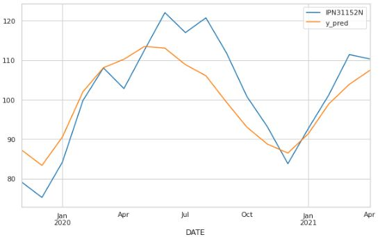
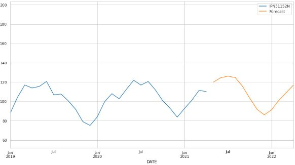

# <h1>
**Forecasting Industrial Production**
</h1>

---

**<h2>Problem Statement: </h2>** 

- To forecast the manufacturing of Ice Cream and Frozen Dessert provided by a previous production history.

 

**Data used**: [Click here to download](https://fred.stlouisfed.org/series/IPN31152N) [592 entries, from 1972-01-01 to 2021-04-01]
 

***Keywords:*** *RNN, Timeseries Generator, LSTM*

---

**<h2>Project Planning :</h2>** 

### **1. Data Understanding**
- **Imports -** 
  - Contains all the imports necessary for reading data, visualizations and model buiding and evaluating.
- **Getting Data -** 
  - Reading the csv, and infering the dates from data.
- **Exploring Data -** 
  - Understanding the nature of the data .info() and graphs
  - Obtaining the number of years and months present.

### **2. Data Preparation**
- **Train Test Split -** 
  - Splitting data in to train and test data.
  - Visualizing the train and test data
- **Scaling Data -** 
  - Scaling train and test set using a MinMax Scaler.

### **3. Building Train and Test Generators**
- Creating a Time series generator for train data and test data.
- Understand the working of a created generator (train_gen)

### **4. Model Building**
- Creating a Sequential Long Short-Term Memory (LSTM) *RNN* model.
- Compiling and Fitting the created model with *Early Stopping* and checking the model summary

### **4. Evaluation**
- **Training and Validation Losses -** 
  - Visualising training loss and validation loss.
  
    
- **Predictions -** 
  - Predicting the test data
  
  
  - plotting it against true values.
  
  - Evaluation of model with RMSE and SI.

### **5. Forecasting** 
  - Building a complete model with accepted parameters on whole dataset without splitting.
  - Forecasting the manufacturing for future 12 months and visualizing it.
  

---

Solution by     : **Aditya Karanth**.

GitHub Profile  : https://github.com/Aditya-Karanth

Kaggle Profile  : https://www.kaggle.com/adityakaranth

LinkedIn Profile: https://www.linkedin.com/in/u-aditya-karanth-2206/
